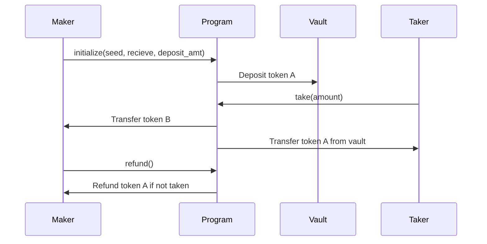

# Escrow Program on Solana

This repository is a **Solana smart contract** for decentralized escrow, written in Rust using [Anchor](https://github.com/coral-xyz/anchor) framework. It provides a secure way for two parties (a "maker" and a "taker") to swap SPL tokens without requiring trust.

---


## Features

- **Escrow Initialization:** Maker sets up an escrow, specifying tokens and amounts.
- **Atomic Swap:** Taker can accept escrow and tokens are swapped atomically.
- **Refund Mechanism:** Maker can reclaim tokens if taker does not accept escrow.
- **Secure SPL Token Transfers:** All transfers use Solana’s token program and associated accounts.
- **End-to-End Integration Testing:** Comprehensive TypeScript tests cover the whole lifecycle.

---

## Technical Architecture

### Smart Contract (Rust, Anchor)

- **Entry Point:** `programs/escrow/src/lib.rs`
- **Instructions:**
  - `initialize`: Sets up escrow, deposits tokens in vault.
  - `take`: Atomically swaps tokens between maker and taker, closes escrow.
  - `refund`: Maker can reclaim tokens and close escrow.
- **State:**
  - `Escrow` struct stores:
    - `seed`: unique identifier
    - `maker`: public key
    - `mint_a`, `mint_b`: SPL token mints
    - `recieve`: amount expected from taker
    - `bump`: PDA bump for escrow account

- **Accounts:**
  - Maker's token accounts for both mints.
  - Escrow PDA for tracking state.
  - Vault PDA for holding deposited tokens.
  - Associated token program, token program, and system program.

### TypeScript (Anchor Integration Tests)

- **Testing Workflow:** `tests/escrow.ts`
  - Sets up local Solana cluster.
  - Mints SPL tokens for maker/taker.
  - Creates associated token accounts.
  - Executes escrow lifecycle (initialize, take, refund).
  - Prints transaction signatures and state for verification.

---

## How It Works

### 1. Escrow Creation (Maker)

- Maker creates an escrow specifying:
  - Amount of token A to deposit
  - Amount of token B to receive
- A vault token account (PDA) is created to hold deposited token A.
- Escrow account stores swap parameters.

### 2. Escrow Acceptance (Taker)

- Taker reviews escrow.
- Taker sends token B to maker’s designated account.
- Vault releases token A to taker.
- Escrow account is closed.

### 3. Refund (Maker)

- If taker does not accept, maker can reclaim tokens.
- Vault releases token A back to maker.
- Escrow account is closed.

### Sequence Diagram



---

## Directory Structure

```
escrow/
├── programs/
│   └── escrow/
│       ├── src/
│       │   ├── lib.rs           # Contract entry
│       │   ├── instructions/    # Instruction handlers
│       │   │   ├── make.rs
│       │   │   ├── take.rs
│       │   │   └── refund.rs
│       │   ├── state.rs         # Escrow state definition
│       │   └── mod.rs
│       └── Cargo.toml
├── tests/
│   └── escrow.ts                # TypeScript integration tests
├── migrations/
│   └── deploy.ts                # Anchor deployment script
├── target/                      # Anchor build outputs
├── Anchor.toml                  # Anchor config
└── README.md                    # This file
```

---

## Getting Started

### Prerequisites

- [Anchor](https://book.anchor-lang.com/getting_started/installation.html)
- [Solana CLI](https://docs.solana.com/cli/install-solana-cli-tools)
- [Node.js](https://nodejs.org/)
- [Rust](https://www.rust-lang.org/tools/install)
- [Yarn](https://yarnpkg.com/) (optional)

### Installation

```bash
anchor install
npm install
```

### Build Program

```bash
anchor build
```

---

## Testing

### Run Integration Tests

```bash
anchor test
```

### What Tests Cover

- Account creation and airdrop
- Minting SPL tokens for both parties
- Initializing escrow (maker deposits tokens)
- Accepting escrow (taker swaps tokens)
- Refund scenario (maker reclaims tokens)
- Transaction logging and signature verification

#### Example Test Output

```
Address of mintA: 4x...2a
Minted 10000 tokens to makerAtaA: 3e...1d
Make escrow signature 5g...8z
Take escrow signature 1v...9u
Refund signature 2p...7n
```

---

## Deployment

### Configure Anchor

Set up cluster and wallet in `Anchor.toml`.

### Deploy Program

```bash
anchor deploy
```

### Custom Deployment

Edit `migrations/deploy.ts` to customize deployment logic, e.g. switch provider, set initial state.

---

## Smart Contract API Reference

### Instructions

#### 1. `initialize(ctx, seed, recieve, deposit_amt)`

- **Purpose:** Maker sets up escrow and deposits tokens.
- **Accounts:**
  - Maker (Signer)
  - Maker's token account (mint_a)
  - Maker's token account (mint_b)
  - Escrow PDA (derived from `seed`)
  - Vault PDA (for deposited tokens)
  - Associated Token Program
  - Token Program
  - System Program
- **Parameters:**
  - `seed`: u64, unique identifier
  - `recieve`: u64, amount expected from taker
  - `deposit_amt`: u64, amount of token A to deposit

#### 2. `take(ctx, amount)`

- **Purpose:** Taker accepts escrow, swaps tokens.
- **Accounts:**
  - Taker (Signer)
  - Taker's token accounts (mint_a, mint_b)
  - Maker's token account (mint_b)
  - Vault
  - Escrow PDA
- **Parameters:**
  - `amount`: u64, amount taker deposits

#### 3. `refund(ctx)`

- **Purpose:** Maker reclaims deposited tokens, closes escrow.
- **Accounts:**
  - Maker (Signer)
  - Escrow PDA
  - Vault

---

## TypeScript API Reference

#### Key Functions

- **Airdrop:**  
  `airdrop(connection, address, amount)`  
  _Airdrops SOL to specified account for testing._

- **Minting Tokens:**  
  Uses `mintTo` from `@solana/spl-token`.

- **Creating Associated Token Accounts:**  
  Uses `getOrCreateAssociatedTokenAccount`.

- **Program Interaction:**  
  Uses Anchor workspace to call smart contract methods.

#### Example: Escrow Initialization

```typescript
const tx = await program.methods.initialize(seed, new BN(1e6), new anchor.BN(1e6))
  .accountsPartial({ maker, escrow, vault, ... })
  .signers([maker])
  .rpc();
```

---


## Contributing

- Fork the repo and submit PRs.
- Open issues for feature requests or bugs.
- See [Anchor documentation](https://book.anchor-lang.com/) for contributing to Solana smart contracts.

---

## License

This project is licensed under the MIT License.

---
